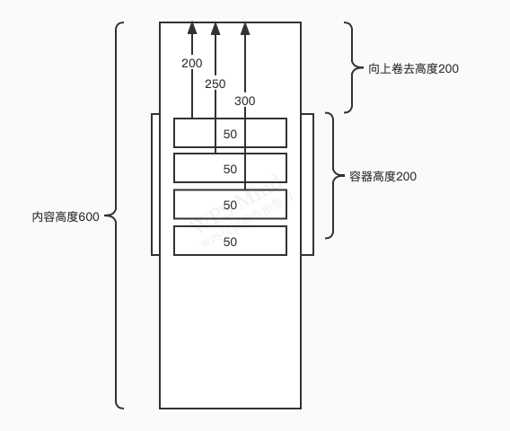
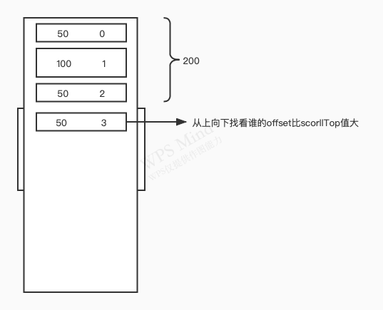

<!--
 * @Author: xinxu azzlzzxz@gmail.com
 * @Date: 2022-06-16 16:28:26
 * @LastEditors: xinxu azzlzzxz@gmail.com
 * @LastEditTime: 2022-06-23 20:37:57
 * @FilePath: /VirtualList/README.md
-->
# 如果有海量数据在浏览器里一次性渲染会有以下问题
1. 计算时间过长，用户需要长时间等待，体验差
2. CPU处理时间过长，滑动过程中可能卡顿
3. GPU负载过高，渲染不过来会出现闪动
4. 内存占用过多，严重会引起浏览器卡死和崩溃
# 优化方法
1. 下拉底部加载更多实现懒加载，此方法随着内容越来越多，会引起大量的重排和重绘，可能会卡顿。
2. 虚拟列表 其实我们的屏幕可视区域是有限的，能看到的数据也是有限的,所以可以在用户滚动时，只渲染可视区域内的内容即可,不可见区域用空白占位填充, 这样的话页面中的DOM元素少，CPU、GPU和内存负载小。

基本原理：总内容relative定位、单个内容absolute(获取条目的高度、偏移量)，采用will-change: transform(优化性能不会导致重绘、重排)。

[will-change](https://developer.mozilla.org/zh-CN/docs/Web/CSS/will-change)
当触发scroll、resize这类的滚动事件时，被触发的频率非常高，间隔也特别近。如果事件中涉及到大量的位置计算、DOM操作、元素重绘等工作，并且这些工作无法在下一个scroll事件出发前完成，就会造成浏览器掉帧（掉帧就是例如图像一闪一闪的,运动不流畅的情况）。加之用户鼠标滚动往往是连续的，就会持续触发scroll事件导致掉帧扩大、浏览器CPU使用率增加，用户体验收到影响。

而CSS属性will-change为web开发者提供了一种告知浏览器该元素会有哪些变化的方法，这样浏览器就可以在元素属性真正发生变化之前提前做好对应的优化准备工作。这种优化可以将一部分复杂的计算工作提前准备好，使页面的反应更为快速灵敏。

will-change的功能是：提前通知浏览器元素将要做什么动画，让浏览器提前准备合适的优化设置。

# 固定高度列表
由于每个条目高度相同，顾只需要计算容器内起始条目的偏移量与结束条目的偏移量(添加缓冲区，使滑动更流畅)。

# 不固定高度列表
因为每个条目的高度不同，所以需要保存每个条目的高度和偏移量，方便读写、计算(index => {size, offset})。
1. 缓存样式
2. 二分查找，指数递增加快找到开始显示条目
3. [IntersectionObserver](https://developer.mozilla.org/zh-CN/docs/Web/API/IntersectionObserver) \
IntersectionObserver接口(从属于Intersection Observer API)为开发者提供了一种可以异步监听目标元素与其祖先或视窗(viewport)交叉状态的手段。\
祖先元素与视窗(viewport)被称为根(root)\
网页开发时，常常需要判断某个元素是否进入了视口(viewport,即用户能不能看到它，然后执行相应的逻辑。\
常见的方法是监听scroll事件，调用元素的getBoundingClientRect方法，得到它对应于视口左上角的坐标，再判断是否在视口之内。这种方法的缺点是，由于scroll事件密集发生，计算量很大，容易造成性能问题。

# 动态计算高度列表
1. [ResizeObserver](https://developer.mozilla.org/zh-CN/docs/Web/API/ResizeObserver) (可以监听到DOM元素，宽高的变化)

- [react-window](https://react-window-next.vercel.app/#/examples/list/fixed-size)
- [react-window 源码](https://github.com/bvaughn/react-window)
- [Taro 虚拟列表源码](https://github.com/NervJS/taro/tree/next/packages/taro-components/virtual-list/react)
- [pnpm](https://pnpm.io/zh/)
- [react-window实现原理](https://github.com/azzlzzxz/react-window)